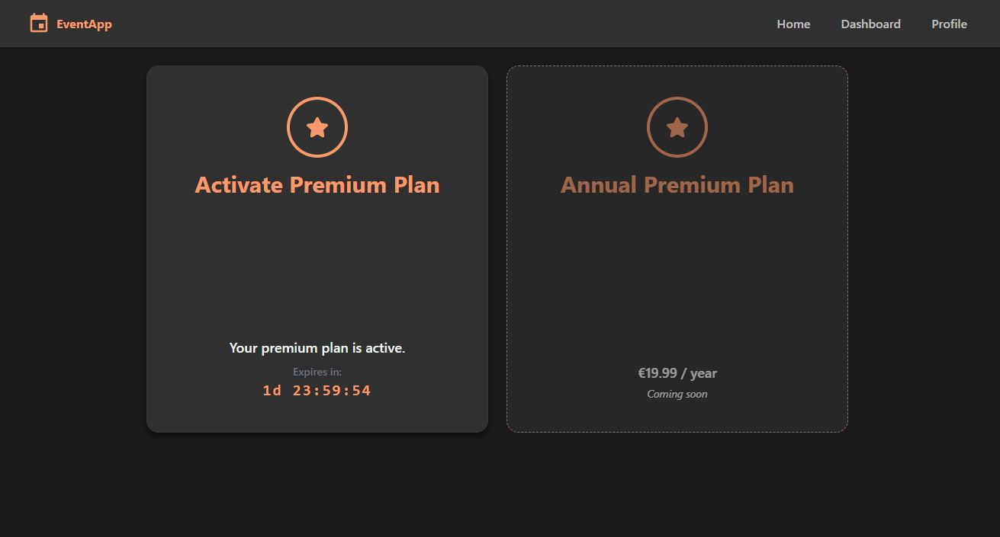

# EventApp

 <!-- Cambia esta ruta si usas otra carpeta -->

---

## 📖 Descripción

EventApp es una plataforma web moderna que permite a los usuarios crear y gestionar eventos fácilmente. Los usuarios pueden invitar a otros a participar, administrar participantes y personalizar los detalles de sus eventos con ubicaciones interactivas mediante mapas. Además, cuenta con un panel de administración para gestionar usuarios, eventos y categorías, y ofrece opciones premium para mejorar la experiencia.

---

## 🛠 Tecnologías utilizadas

- **Frontend:** React con React Toolkit, Tailwind CSS  
- **Backend:** Laravel (PHP)  
- **Base de datos:** MySQL  
- **Mapas:** Leaflet.js  

---

## 🚀 Instalación y uso

### Requisitos previos

- Node.js y npm  
- PHP (compatible con Laravel)  
- Composer  
- MySQL  

### Pasos para ejecutar localmente

1. Clona el repositorio:  
   ```bash
   git clone https://github.com/BernatDeveloper/eventos-app.git
   cd eventos-app

2. Instala las dependencias del backend (Laravel):
    ```bash
    cd backend
    composer install

3. Configura el archivo .env con tus credenciales de base de datos y otros parámetros.

4. Ejecuta las migraciones para crear la base de datos:
    ```bash
    php artisan migrate

5. Levanta el servidor backend:
    ```bash
    php artisan serve

6. Instala las dependencias del frontend (React):
    ```bash
    cd ../frontend
    npm install

7. Ejecuta el frontend en modo desarrollo:
    ```bash
    npm run dev

8. Abre el navegador en http://localhost:5173 (o el puerto que React indique).

---

## ⚙️ Funcionalidades principales

- Creación y gestión completa de eventos.

- Invitación a usuarios vía email o a través de la plataforma.

- Geolocalización y selección de ubicación del evento con mapas interactivos (Leaflet).

- Gestión de participantes y límite máximo.

- Edición de información del evento: título, descripción, categoría, fechas y límites.

- Modo claro y oscuro para la interfaz.

- Generación automática de descripciones de eventos mediante IA.

- Panel de administración para gestionar usuarios, eventos y categorías.

- Registro y login de usuarios.

- Perfil de usuario con edición de nombre e imagen.

- Suscripción a plan premium con mejoras visuales y funcionalidades extra.

---

## 🌐 Demo

Puedes ver la aplicación en vivo aquí: https://eventos-app.vercel.app/

---

## 📷 Capturas de pantalla

| **Landing Page** |
|------------------|
|  |

| **Registro** | **Login** |
|--------------|-----------|
|  |  |

| **Panel de usuario (Dashboard)** |
|----------------------------------|
|  |

| **Crear evento** |
|------------------|
|  |

| **Vista del evento como participante** |
|----------------------------------------|
|  |

| **Vista del evento como creador** |
|-----------------------------------|
|  |

| **Modal de edición del evento** | **Modal de edición de la ubicación** | **Modal para invitar usuarios** | **Edición de la categoría del evento** |
|-----------------|-----------------|-----------------|-----------------|
|  |  |  |  |

| **Participantes del evento** |
|------------------------------|
|  |

| **Notificaciones** |
|--------------------|
|  |

| **Perfil** |
|------------|
|  |

| **Planes priemium** |
|------------|
|  |

| **Panel de admin** | **Lista de usuarios** | **Lista de eventos** | **Lista de categorías** |
|--------------------|--------------------|--------------------|--------------------|
|  |  |  |  |

---

## 📝 Autor

**Bernat Font**

---

## 📜 Licencia

Este proyecto está bajo la licencia [MIT License](./LICENSE).
Puedes consultar el archivo `LICENSE` para más detalles.

---

## 🔮 Futuras mejoras

- Implementar chat en tiempo real dentro de los eventos para que los participantes puedan comunicarse.

- Sistema de planes de pago para usuarios premium (por ejemplo, suscripción anual).

- Exportar eventos a Google Calendar
---

## 🤝 Contribuciones

¡Las contribuciones son bienvenidas! Si quieres aportar, por favor abre un issue o un pull request con mejoras o correcciones.

## 📧 Contacto

Si tienes preguntas, puedes contactarme en bernatfontdeveloper@gmail.com